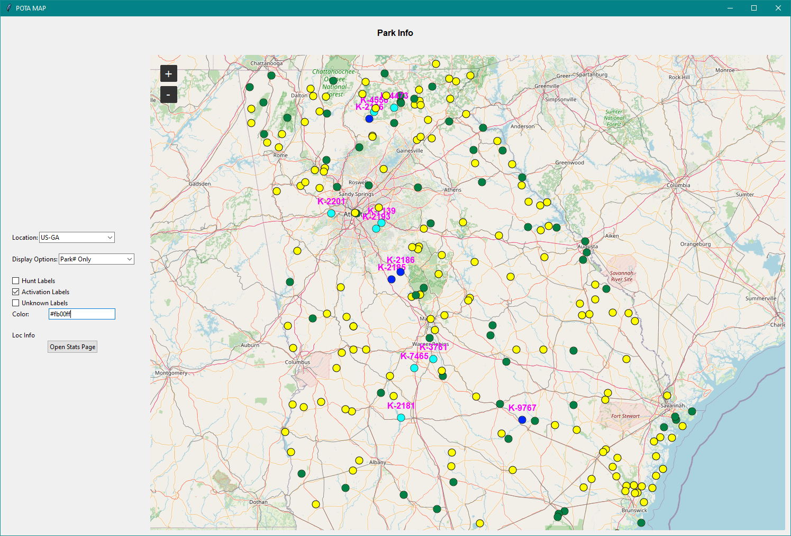
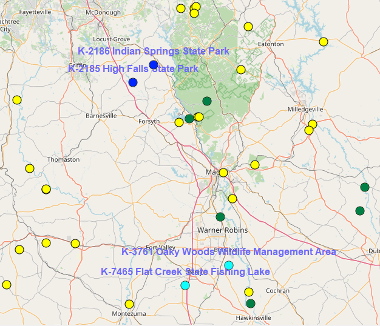
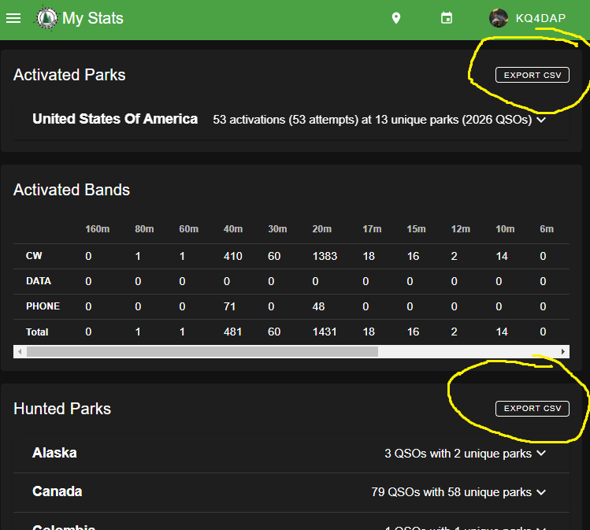
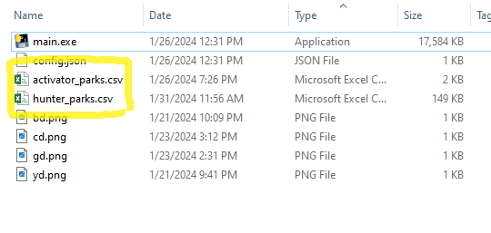

# potamap 

Potamap displays a map of all the parks in a given area and indicators
of if you have hunted or activated it.

Here's what the window looks like. Select the area you wish to view on the left
and the map will change on the right. The park markers can be clicked to see 
the name at the top.

A closer view. The yellow dots are un-hunted and un-activated. The green dots 
are hunted parks. The blue dots are activated. The cyan dots are activated and 
hunted. The labels can be configured somewhat.

## Usage

### Step 1

To display your hunts and activations you must go to your "My Stats" page on 
https://pota.app and click 'Export CSV' for both your hunted stats and your 
activated stats. You should have two files: `hunter_parks.csv` and 
`activator_parks.csv`.

### Step 2

These need to be placed in the same location as the build output (exe).

After this you may now execute `main.exe`. 

Any other files needed by the app are downloaded via the POTA api. These files 
generally have the `.json` extension. They can be deleted to force the app to 
re-download them. Some of these files can be big so if the app hangs up, its 
probably downloading files.

## Dependencies

Built using python 3.9.13 with VSCode on Windows. It uses TTK, tkintermapview, the POTA API.

See ``requirements.txt`` for all the deps but just do this

    $ pip install tkintermapview
    $ pip install pyinstaller

Then you should be able to run script and build the output

[pota-img]: https://static.pota.app/pota-logo-38x38.png
